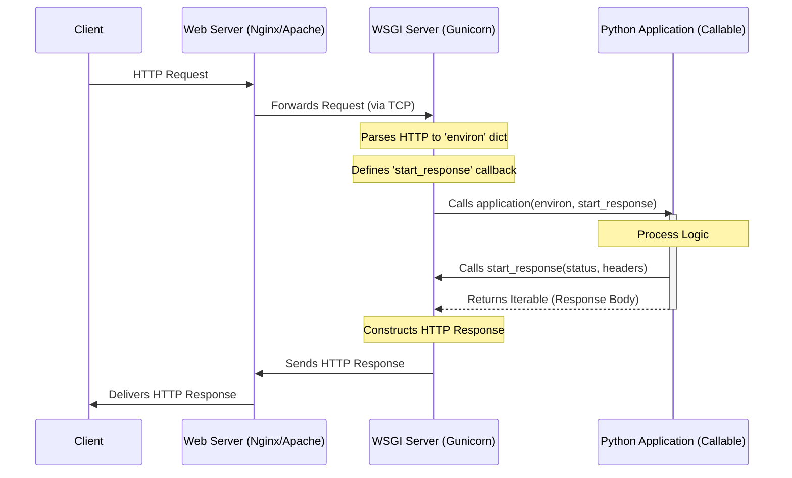
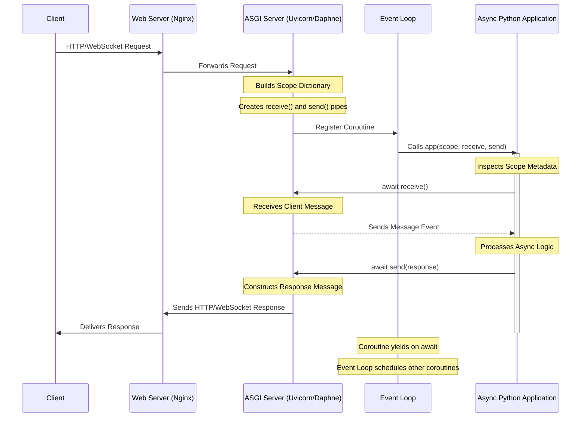

# Use of FastAPI for Generative AI Backend

### Table of Content
- [Use of FastAPI for Generative AI Backend](#use-of-fastapi-for-generative-ai-backend)
    - [Table of Content](#table-of-content)
  - [1. Problem Statement](#1-problem-statement)
  - [2. Constraints of the Past](#2-constraints-of-the-past)
    - [2.1 Introduction to WSGI](#21-introduction-to-wsgi)
    - [2.2 Callflow of a request on a WSGI server](#22-callflow-of-a-request-on-a-wsgi-server)
    - [2.3 Understanding building blocks of a computer hardware](#23-understanding-building-blocks-of-a-computer-hardware)
      - [2.3.1 Logical Threads](#231-logical-threads)
      - [2.3.2 OS Threads](#232-os-threads)
      - [2.3.3 Green Threads](#233-green-threads)
      - [2.3.4 Processes](#234-processes)
      - [2.3.5 Workers](#235-workers)
    - [2.4 Understanding WSGI infrastructure wise](#24-understanding-wsgi-infrastructure-wise)
    - [2.5 Limitation of WSGI](#25-limitation-of-wsgi)
  - [3. The Requirements of the Present](#3-the-requirements-of-the-present)
    - [3.1 Understanding how communication takes place between a client and ASGI server](#31-understanding-how-communication-takes-place-between-a-client-and-asgi-server)
    - [3.2 Understanding the callflow of a request handled by a ASGI server](#32-understanding-the-callflow-of-a-request-handled-by-a-asgi-server)
    - [3.3 ASGI unit of work](#33-asgi-unit-of-work)
    - [3.4 Cooperative mutlitasking](#34-cooperative-mutlitasking)
    - [3.5 ASGI's engine](#35-asgis-engine)
    - [3.6 Comparing WSGI with ASGI](#36-comparing-wsgi-with-asgi)
    - [3.7 Why ASGI servers matter to AI](#37-why-asgi-servers-matter-to-ai)
  - [4. FastAPI - putting it all together](#4-fastapi---putting-it-all-together)
    - [4.1 Understanding FastAPI framwork architecturally](#41-understanding-fastapi-framwork-architecturally)
    - [4.2 Understanding usage of asyncio.to\_thread, asyncio.create\_task and background tasks](#42-understanding-usage-of-asyncioto_thread-asynciocreate_task-and-background-tasks)
  - [5. Conclusion](#5-conclusion)
   
## 1. Problem Statement
The AI ecosystem is predominantly python based. In the generative AI era we would need to use systems that allows to keep up with the changes that are happening in the AI space.

In order to build **production-grade applications** with generative AI it is very important to understand the infrastructure that is being used to build such systems. The very first component of this system is the application interface that will be used to serve generative ai services.

This document is created for the following reasons:
1. **Technical Justification**: Document why **FastAPI** framework is chosen as the application interface and keep a record of architectural decision made for the choice of backend to server generative AI services.
2. **Educational purpose**: Serve as a reference for developers to leverage fastAPI web framework while building python based web applications.

## 2. Constraints of the Past
### 2.1 Introduction to WSGI
In the early days of python web application development. If you wrote a web application using frameworks like **Django** then it would only work with certain web servers. If in future you had to migrate to a different web server you had to first check the compatibility of your existing piece of software with the web server you were trying to migrate to. This problem is most commonly known as **Fragmentation**.

**Fragmentation** is a **MxN** problem. For example if we had 5 different python frameworks for web developments (Zope, early Django etc) and 5 different servers (Apache, Nginx etc) where we did not have a standard interface for these frameworks to communicate with different servers. An adapter would have to be written to glue a particular type of web development framework to a particular type of web server. This means 25 adapters would have to written and maintained.

To solve for this problem a protocol was introduced called **WSGI**. WSGI is a set of protocols written to make web applications built using python **server agnostic**. It is important to remember that WSGI is a convention and not a software that gets installed.

The goal of **WSGI**:
1. Portability: The developer should be able to write an application once and run it on any server
2. Flexibility of the Framework: Developers should worry about the product's features rather than low level details of how a web server should handle a connection and how a framework should interact with the web service.
3. Decoupling of the web server from the application logic

WSGI lead to resolving the problem of **fragmentation (MxN problem)** into a **1+1** problem
   1. Web server maintainers/developers had to now only write and handle **1** web service gate.
   2. Web application framework maintainers/developers only had to write and maintain **1** code that follows **WSGI protocol**

The WSGI protocol defined an interface to be made up of 2 components.
1. **Server**: This component must be able to **call** a **function/method** provided by the application
2. **Application**: This component must provide a callable **function/method** that takes 2 specific arguments
   1. `environ`: A dictionary  (hashmap) containing information about the headers, environment variables, request type, payload and server information.
   2. `start_response`: A callback function that must send the **HTTP** `status_code` and response headers back to the server.

It will become clear how this `environ` hashmap and `start_response` function are used.

### 2.2 Callflow of a request on a WSGI server

### 2.3 Understanding building blocks of a computer hardware
Before we understand how the WSGI servers are built architecturally we need to understand the different terms used such as **logical threads**, **OS threads**, **green threads**, **processes** and **workers**.

#### 2.3.1 Logical Threads
- These threads are a feature of your CPU's core.
- A CPU core can be splitup into multiple logical cores.
- An example - A 4 core CPU will be equivalent to 8 logical cores
- You can't manifest new logical cores (logical threads)

#### 2.3.2 OS Threads
- These are threads managed by the OS (Operating System)
- The OS uses a scheduler that decides when a thread starts and stops. It can pause one thread to start another
- These threads are used to determine what set of instructions will be executed on the CPU's core by communicating with the logical threads
- Python has a limitation of **GIL** (Global Interpreter Lock) which limits only 1 OS thread to execute python byte code at a time.
- Each thread occupies **1-8 MB of memory** (which is very large) and this memory is not shared with other threads
- The number of threads the OS can spawn depends upon the CPU and RAM resources.
- On modern infrastructure you can spawn 100s of OS threads.
  - We know that OS has a scheduler which allows us to switch between threads (this switching between threads is called **context switching**).
  - We also know that each thread occupies **1-8 MB of memory**
  - If large number of threads are spawned the performance of the application drops as the CPU spends more time in context switching instead of executing instructions.
  - For each thread that is spawned the OS scheduler will have to provide a **slice of time** to the spawned thread. This slice of time is the amount of time the CPU is allowed to work on the instructions of a thread and it is forced to switch (this is called **preemptive multitasking**)
  
#### 2.3.3 Green Threads
- These are '**User-space threads**' threads created and managed by libraries or runtime languages.
- These green threads are extremely lightweight and few KBs.
- You can spawn 1000s of green threads for a single OS thread.

#### 2.3.4 Processes
- A process is an independent instance of a program.
- It has it's own memory space and is isolated from other programs
- For example - A python process is an independent instance of python with its own memory space and GIL

#### 2.3.5 Workers
- In web applications a worker is responsible for a single process

### 2.4 Understanding WSGI infrastructure wise
- When we start a WSGI server it spawns a **Master** worker. The role of this master worker is to only manage other **process workers**. 
- Each **process worker** is responsible for a single process
  - In WSGI the process worker can have two modes
    1. **Process only mode**: The workers are spawned as **single threaded** processes which handle **1 request at a time**
    2. **Threaded mode**: The workers are spawned as processes which have **multiple** threads associated with them. These workers can handle multiple requests at a time
- You can choose to set the **mode** of the workers as **process only mode** or **threaded mode**. Traditionally WSGI is deployed using a fixed number of process-based workers which is 1. (as its too costly to maintain threaded mode due to the amount of resources consumed by each thread)
- By default each worker handles only 1 Request at a time. This configuration can be change if the tasks are more I/O bound tasks then number of threads per worker can be increased as 1 Request at a time is not scalable to handle multiple requests

### 2.5 Limitation of WSGI
- WSGI was created during an era where the web applications were simple and there was not much online traffic due to which the communication betweent the client and server was strictly **synchronous**.
- The threads are blocked till the request is completed and other requests can't be handled during this time.
- To handle **10,000 concurrent** requests we have to spawn **10,000 workers** which is not **monetarily** feasible (as this will also come with replication of 10000 instances of python interpretors leading to increase in CPU cores and RAM).
- The modern era also demands long lived connections to perform long complicated tasks and because of this synchronous behaviour it becomes very difficult to scale WSGI servers
- The WSGI contract also converts the entire HTTP request into a `environ` dict and sends it to the server to process it. 
  - So even for a simple task of returning **hello** the server will package the request into one `environ` dictionary. The time it takes to package `environ` is more than the time it takes to handle the simple task of processing simple requests.

**Note**:
  - In the context of Generative AI where a single LLM inference request might take 2-10 seconds a WSGI worker is considered 'dead' to the rest of the world for that entire duration. This synchronous blocking makes WSGI fundamentally incompatible with the high-latency nature of LLM serving.

To overcome the limitation of synchronous way of handling requests and the inability to scale WSGI servers **ASGI** servers were introduced

## 3. The Requirements of the Present
**ASGI** stands for Asynchronous Server Gateway Interface. It is the successor of WSGI. The most important factor that makes ASGI different from WSGI is it's support for **asynchronous** workflows. Like WSGI ASGI is server agnostic in nature.

There are 2 concepts that  did not exist in the WSGI world
1. **Asynchronous Callable Functions**: Asynchronous processes are processes that can be initiated and voluntarily can be stepped out off to work on other tasks while this asynchronous process is being completed. Similarly asynchronous functions are functions that can called and voluntarily stepped out off to work on other async functions while the former is getting completed.
2. **Message Based Communications**: WSGI was designed for a single request-response cycle where the entire information is packed into one single packet and sent to the server and this connection occupies the channel created between the client and server till the request is completed and server sends a response back to the client. In ASGI this changes the communications takes place through a series of discrete **messages**. Instead of one big synchronous function call the client and servers in ASGI communicate with each other by sending messages over a period of time.

### 3.1 Understanding how communication takes place between a client and ASGI server
- The communications between the client and the server takes place through a **contract**.
- For ASGI this contract is represented by 3 components
  1. **Scope**:
      - It is similar to `environ` of WSGI.
      - It is a dictionary (hashmap) that stores the information (**metadata**) of the request
      - The metadata includes:
        1. The **proto** type (whether the communication is taking place over **http** or **websocket**)
        2. The headers of the request
        3. Path of the request
        4. Query strings
        5. Client IP address
      - The metadata is **static** in nature it does not include the request's **payload** (because of which the scope is very small and has a small overhead)
      - The scope is kept alive until the user disconnects
  2. **Receive**:
      - ASGI calls it an asynchronous callable function but it is nothing but a asynchronous communication pipe.
      - It is used by the application to receive messages from the server 
  3. **Send**:
      - It is similar to **Receive**
      - It is used to send messages back to client

### 3.2 Understanding the callflow of a request handled by a ASGI server
- When a request is received by the ASGI server, the server looks at the request and builds the `scope`  by adding the **static** metadata of the request to the scope. 
- Once the `scope` has been built the server calls the application also providing it the `scope`, `receive` pipe and `send` pipe.
- The application by using the meta data looks at what type of request needs to be handled.
- If it requires data it will call `await receive()` and it needs to provides a response back to the client it will call `await send()`
- This way continuous streams of messages can be passed to the application from the client and vice-versa.

### 3.3 ASGI unit of work
- For WSGI the unit of work is **OS thread** where as for ASGI it is **coroutines**.
- From [2.3.2 OS Threads](#232-os-threads) we know that OS threads have a large overhead and occupy a large chunk of memory which does not get shared with other threads. In WSGI we go for **pre-emptive multitasking** where the OS's scheduler provides a time slice to the OS thread by forcing it stop and starting another thread's instruction on the CPU.
- A **Coroutine** is a software defined "thread". these are different from green threads as emulate OS threads in the way that they also go through the process of **pre-emptive multitasking**
- Coroutines do not have a fixed 1-8 MB stack. It only takes up a few KBs like green threads.
- There is not forceful stopping of a coroutine. The coroutine voluntarily gives up the control back when it has to wait. This is called **cooperative multitasking**.
- Switching between coroutines is incredibly fast as we are essentially moving a pointer from 1 object to another within the same process.

### 3.4 Cooperative mutlitasking
- In WSGI servers if we perform `requests.get('http//:some-site.com')` the thread on the server (worker) gets blocked till the request is completed.
- In ASGI when we use coroutines we can voluntarily give control back by using `await`
- `await` does 3 things
  1. **Pause**: It marks a "**yield point**". It tells python interpretor that it is waiting for a set of instructions to get executed and is idle for that period of time.
  2. **Handover**: It voluntarily packages up it's current state and hands control back to the ASGI server's engine **Event Loop**
  3. **Resume**: The engine goes off and does other work. The engine will return to the awaited request to see if the instructions have executed if they have not it will again go and do some other work. If they have then it will start executing instructions after the yield point.
- This voluntarily handover of control while the request waits is why ASGI servers are used for data intensive applications where the data takes time to be processed by other services.
- This type of multitasking is what we call **Cooperative Multitasking**.

### 3.5 ASGI's engine
- **Event Loop** is the engine of ASGI servers which allows the server to handle the execution of coroutines.
- The event loop is a continous while loop running inside a **single** thread.
- The job of the event loop is to continously monitor events and schedule the execution of coroutines associated with those events.
- When you start a ASGI server the server registers coroutines with the event loop
- The loop uses low level OS primitives to continously monitor these events by monitoring if the network sockets have received any data
- If a socket receives any data then the loop wakes up the specific coroutine that will process the incoming data.
- If the coroutine triggers await it will perform **cooperative multitasking** and return control back to the event loop. This cycle repeats and the event loop makes sure that the CPU never sits idle.
- The efficiency of the event loop depends upon the type of tasks the coroutine performs.
- **Non Blocking I/O** tasks are ideal when it comes to ASGI servers.

### 3.6 Comparing WSGI with ASGI
- In WSGI we have **1 worker 1 request**. As **1 worker = 1 process = 1 thread** where as in ASGI 1 worker can handle **1000**s of coroutines.
- The bottleneck shifts from concurrency to CPU throughput
- Even though ASGI servers are meant to use coroutines there still exists a threadpool executor associated with a worker as not all requests would be asynchronous in nature.
- To handle synchronous request the event loop hands over the request to the threadpool executor in order to **not** freeze up.

### 3.7 Why ASGI servers matter to AI
- For data intensive applications we are looking at problem statements where the major computation is offloaded to other services. These services take time to get completed and hence require long lived connections.
- In data intensive applications there are 1000s of requests hitting the server and to handle such large volumes of connection requests which can be long lived we should use ASGI protocol based servers
  
## 4. FastAPI - putting it all together
The application is not the server itself. It is a piece of software that is built using a **framework** that follows a certain protocol. For data intensive applications we need to use a framework that follows ASGI protocol. FastAPI is one of the best framework for this.

### 4.1 Understanding FastAPI framwork architecturally
- In a standard FastAPI deployment you typically have 3 layers
  1. The process manager (**Gunicorn**)
  2. The worker (**Uvicorn**)
  3. The application (**FastAPI**)
- The application itself does not manage the workers and threads.
- There are two different approaches to handle these workers
  1. **Process Management** (Gunicorn way): The only job of a process manager is to start, monitor and restart the worker process if they crash. It does not do the tasks of the applications itself. `gunicorn main:app --workers 4 --worker-class uvicorn.workers.UvicornWorker --bind 0.0.0.0:8000` is the standard way to start a FastAPI application on uvicorn processes using Gunicorn as the process manager.
  2. **Protocol Translation** (Uvicorn way): In modern day application deployment we go for containerization of applications. For this we use popular containerisation engines such as **Docker** or **Kubernetes**. These themselves are process managers so we dont need to start a process manager within a process manager. You can use uvicorn to be the worker and manage other workers `uvicorn main:app --workers 4` will start 4 worker processes
- When you start a FastAPI application is starts up by default with **1** worker process.
- A worker process is a single threaded processes which runs the **Event Loop** engine.
- A threadpool executor is assigned to each worker process. By default this threadpool executor can pool maximum **40** threads. The threadpool executor has an internal task queue which is **unbounded**.
- If we are receiving 100 **concurrent** requests then in our default setting 40 requests will start getting processed and the remaining will be placed inside the queue. The queue is unbounded by nature so it will keep on stacking these requests until it has an OOM issue.
- In FastAPI you can define two types of routes (functions/callables):
  1. **Synchronous**: These are defined using the way we normally define a function in python `def`. For these functions FastAPI assumes the route will contain blocking I/O and to prevent it from freezing up, it on its own sends **the message request from the event loop to the threadpool executor**
  2. **Asynchronous**: These are defined by attaching async function to def `async def`. These routes are directly called on the event loop. The code inside these functions should always be non blocking (should be awaitable)

To make sure our application is running efficiently we need to keep in mind how to work with fastAPI. We know there are two types of routes that can be defined in fastAPI. There are cases where we have no choice but to mix them up. The mixup most of the time happens when you are creating asynchronous routes where you are using long sequences of synchronous instructions. To handle such situations we use libraries such as asyncio and fastAPI's native background tasks.

### 4.2 Understanding usage of asyncio.to_thread, asyncio.create_task and background tasks
1. `asyncio.to_thread()`: If your code is synchronous in nature and you have to use it within an **asynchronous** route you should move it onto the threadpool executor that comes with the worker process. To so you use `asyncio.to_thread()` function. This allows you to now make the synchronous code **awaitable**. The entire synchoronous code will be processed by the thread of the threadpool executor before freeing up the thread. It is always advisable to write synchronous functions within async routes to be small for the threads to execute faster.
   
2. `asyncio.create_task()`: If there are asynchronous functions being called within the async routes and you want the functions to take the same priority as that of the route it self you can usign `asyncio.create_task()`. The task passed to it will be handled by the event loop with the same priority. For example if we want to log that a user has visited a page. We dont want the user to wait for this logging function as it is not relevant to the request the use rahs made then what we can do is we can use `asyncio.create_task()` (**dont `await` it**) to move the logging task to event loop and return the response to the user. If you dont await it then the route wont wait for the task of logging to be completed. When using `asyncio.create_task` it is a best practice to maintain a reference to the task object to prevent the garbage collector from prematurely terminating the operation.
   
3. `BackgroundTasks`: These are native to FastAPI and are designed to run after the current request has been completed. If the task is synchronous it will be sent to the threadpool executor and if it asynchronous it will be handled by the event loop 
 
## 5. Conclusion
By selecting FastAPI we gain a system that is:

1. **Concurrently Capable**: Able to handle the high-latency "wait times" of LLM API calls and model inference without blocking other users.

2. **Resource Efficient**: Utilizing cooperative multitasking (coroutines) to serve thousands of requests with a fraction of the memory overhead required by traditional thread-per-request models.

3. **Operationally Flexible**: Providing a "safety net" via its internal ThreadPool for synchronous code while offering advanced primitives like asyncio routes for high-performance non-blocking logic.